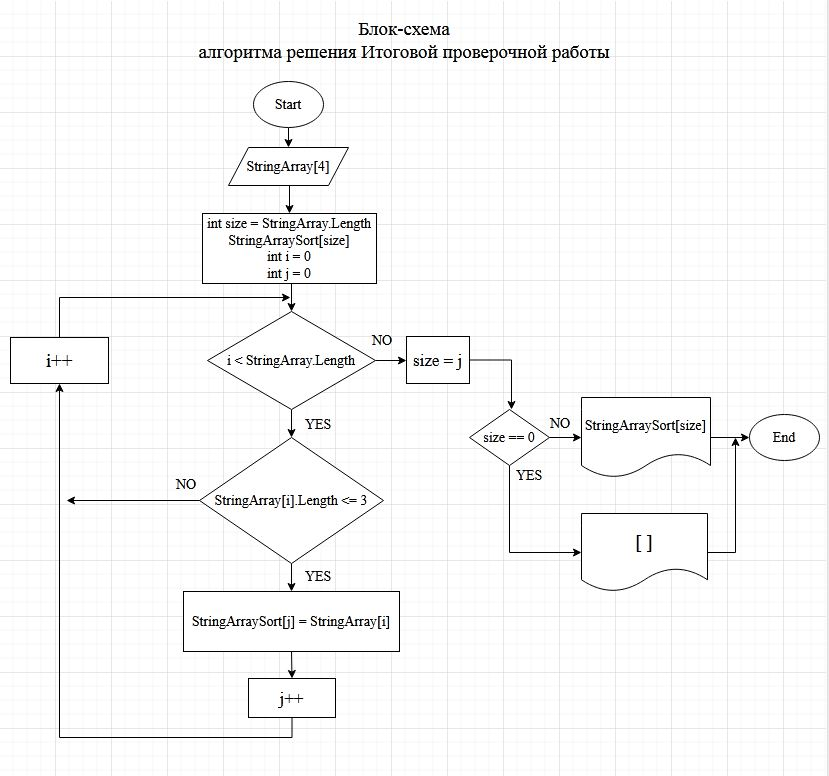

    Задание для Итоговой проверочной работы:

    Написать программу, которая из имеющегося массива строк формирует массив из строк, длина которых меньше, 
    либо равна 3 символа. Первоначальный массив можно ввести с клавиатуры, либо задать на старте выполнения алгоритма. 
    При решении не рекомендуется пользоваться коллекциями, лучше обойтись исключительно массивами.

Решение:
1. Объявляем:

    1.1. Массив ***stringArray[4]***;

    1.2. Переменную ***size = stringArray.Length*** (равную длине массива ***stringArraySort***, первоначально принимаем по наибольшей возможной длине массива, далее в процессе наполнения данного массива она будет уточнена);

    1.3. Массив ***stringArraySort[size]***.

2. Предлагаем пользователю ввести с клавиатуры четыре слова (набора букв, символов) произвольной длины.
3. Организуем цикл ***for*** от 0 до ***stringArray.Length***, и присваиваем i -му элементу массива ***stringArray*** строку, введенную с клавиатуры: ***stringArray[i] = Console.ReadLine()***.
4. С помощью метода: ***PrintArray(string[] array)*** выводим на экран полученный массив ***stringArray[4]***.
5. С помощью метода ***SortArray(string[] Array, string[] ArraySort)*** записываем в массив ***stringArraySort[size]*** строки, длина которых состоит из трех или менее символов.

    5.1. Метод ***SortArray(string[] Array, string[] ArraySort)*** организован с помощью цикла ***for*** от 0 до ***Array.Length*** и оператора ***if***, который сравнивает i -ю строку массива ***stringArray*** и, если ее длина меньше или равна 3, записывает ее в j -ю строку массива ***stringArraySort***. По окончании цикла присваиваем переменной ***size*** значение переменной j, которая (после окончания цикла) и будет длиной отсортированного массива ***stringArraySort[size]***. 

6. С помощью оператора ***if*** проверяем длину массива ***stringArraySort***. Если ***size == 0***, то выводим на экран: "Массив строк, в которых три или менее символов, после сортировки введенного массива: []". Если ***size > 0***, с помощью метода: ***PrintArray(string[] array)*** выводим на экран отсортированный массив ***stringArraySort***.

7. На рисунке 1 представлена блок-схема алгоритма решения данной задачи (организация циклов for при вводе с клавиатуры и выводе на экран массивов для упрощения не показана).

8. Программа работает с количеством вводимых слов  равным 4 (длинна массива ***stringArray***), для изменнения данного количества необходимо в строке 1 программы (***string[] stringArray = new string[4]***) цифру 4 заменить на необходимую для работы и подправить сообщение пользователю, либо организовать ввод и считывание переменной, которая будет длинной массива ***stringArray*** с клавиатуры. 

Рисунок 1

